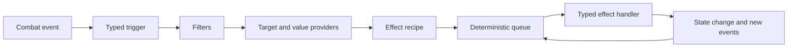

<div align="center">

# ⚙️ RogueDeck Core

### Build the mechanic. Keep the core clean.

A deterministic, modular C# combat engine for roguelike deckbuilders — built to absorb strange mechanics without becoming a giant switch statement.

<br>

<a href="https://github.com/Paranoidgrinch/RogueDeck-Core">
  
</a>
<a href="https://github.com/Paranoidgrinch/RogueDeck-Core/tree/main/src/RogueDeck.Core/Combat">
  
</a>
<a href="https://moonvineforge.com/card-forge.html">
  
</a>

<br><br>

[](https://github.com/Paranoidgrinch/RogueDeck-Core/actions/workflows/ci.yml)


</div>

---

## The rule above all others

> **Adding a new effect must not require changing the central resolver.**

RogueDeck Core is being built around composition rather than special cases:

* no central switch over concrete effects
* no hardcoded `PoisonStacks`, `IsStunned` or `Thorns` fields
* no game-specific rules hidden inside turn processing
* no effects bypassing the deterministic queue
* no unrelated systems changing whenever a new mechanic appears

A mechanic should join the engine through focused definitions, handlers, providers and packages — not by teaching the entire core what that mechanic is.

---

## Compose mechanics instead of hardcoding them

Triggered mechanics are separated into five questions:

```text
WHEN       What happened?
IF         Which conditions must match?
WHO        Which combatants are affected?
HOW MUCH   How is the value calculated?
WHAT       Which primitive effect is requested?
```

That means an existing event can be combined with an existing effect without requiring another event-specific engine class.

Examples:

```text
WHEN damage is received
IF the target has Thorns
WHO the attacker
HOW MUCH the current Thorns value
WHAT deal damage
```

```text
WHEN a skill card is played
IF it is the second skill this turn
WHO the player
HOW MUCH 1
WHAT draw cards
```

The content describes the interaction.

The engine resolves it.

---

## How resolution works



Effects and events continue through the queue until the chain is complete or combat ends.

Chain ancestry, re-entry rules and configurable depth limits keep reactive mechanics powerful without allowing accidental infinite loops.

---

## Current capabilities

The combat core currently includes:

* deterministic combat state and seeded random behaviour
* modular effect-request and handler registries
* ordered effect and event queues
* turn, round and combat-result lifecycles
* cards, card instances and card zones
* draw, discard, exhaust, banish and retain behaviour
* card costs and cost modifiers
* reusable resources and resource lifecycles
* status definitions, stacking, duration and charges
* damage, healing, block and defensive pools
* typed target selectors and value providers
* card, status, resource and lifecycle triggers
* multi-target card behaviour
* effect-chain causality and re-entry protection
* package-based registration
* combat logging
* architecture guard tests
* extensive behavioural and integration tests (1,300+ across the solution)

Mechanics are authored as **Effect Programs** — typed trees of nodes (sequence, conditional, causal, repeat,
for-each) over native operations, value expressions and target selectors — validated by a build-time
preflight and executed on the deterministic queue. Cards, enemy actions, triggered programs and runtime
temporary rules all run through the same runtime.

---

## The toolchain around the core

Three projects sit on top of the engine so mechanics can be authored, played and stress-tested without a real
game in front of them.

### Scenario harness — `RogueDeck.Scenario`

A fluent DSL for describing a combat as **blueprints + scripted turns**, driven through the *real* engine
(`ScenarioRunner` runs actual turns via the turn processor — it does not simulate). A run produces a
`ScenarioReport` with per-step state and a `NarrativeLogRenderer` that turns the combat log into a readable
play-by-play. This is the substrate everything else builds on.

### Sandbox — `RogueDeck.Sandbox`

A Blazor browser editor for defining a hero, enemies (with per-round intents) and cards (cost + composed
effects), then running the fight via the harness. It aims at **complete practical engine coverage**: every
native op, value read, arithmetic operator, control-flow node, trigger event, target selector, interceptor
and death-prevention rule is exposed in the UI, plus duration statuses, real-deck vs fixed-hand play, a
card-instance picker, JSON save/load, and a live narrative log. The point is to let a user be creative and
exercise the whole engine, not a curated subset.

### Fuzzer — `RogueDeck.Sandbox/Fuzzing`

A bot that generates random-but-valid scenarios from the full vocabulary and plays them to surface crashes
and determinism violations. It found and drove fixes for several composer bugs and three engine hardenings
(skip-downed-on-hand-off, saturating arithmetic, runner turn-guards); a 20 000-seed sweep is now clean.

---

## What RogueDeck Core is not

RogueDeck Core is currently an **engine architecture project**, not a playable game.

The present focus is the reusable combat language beneath a roguelike deckbuilder.

The core deliberately does not contain:

* rendering
* animations
* input handling
* a fixed user interface
* game-specific visual assets
* hardcoded classes, worlds or themes

A console sandbox exists for development, but the engine is designed to sit beneath different front ends and different games.

---

## Run the project

### Requirements

* [.NET 10 SDK](https://dotnet.microsoft.com/download/dotnet/10.0)
* Git

### Clone and validate

```bash
git clone https://github.com/Paranoidgrinch/RogueDeck-Core.git
cd RogueDeck-Core
dotnet restore
dotnet test
```

The CI workflow restores, builds and tests the solution (Windows + Linux), verifies formatting with
`dotnet format`, and builds the benchmarks on every push and pull request to `main`.

### Run the sandbox

```bash
dotnet run --project src/RogueDeck.Sandbox
```

Then open the printed `http://localhost:<port>` URL to define a hero, enemies and cards and play a fight.

---

## Repository structure

```text
RogueDeck-Core
├── src
│   ├── RogueDeck.Core            # the engine library (Combat: Cards, Effects, Resources, …)
│   ├── RogueDeck.Scenario        # scripting harness: blueprints, fluent DSL, runner, narrative log
│   ├── RogueDeck.Sandbox         # Blazor browser editor + random-scenario fuzzer (Fuzzing/)
│   └── RogueDeck.ConsoleSandbox  # scratch runner / smoke demo
├── tests
│   ├── RogueDeck.Core.Tests      # the main engine suite
│   ├── RogueDeck.Scenario.Tests
│   ├── RogueDeck.Sandbox.Tests   # includes the fuzzer regression test
│   └── RogueDeck.Core.Benchmarks # BenchmarkDotNet
└── .github/workflows/ci.yml
```

---

## Where to look

This README is the front door; the engine documents itself through code and tests.

* **`src/RogueDeck.Core/Combat`** — the engine: combat state, effect handlers, queues, events, packages,
  lifecycle rules, target selectors, value expressions and the Effect Program runtime.
* **`tests/RogueDeck.Core.Tests`** — the executable specification: every behaviour the engine guarantees has
  a focused test, including architecture-guard tests that enforce the constraints above.
* **`src/RogueDeck.Scenario`** — the worked example of *using* the engine end to end via the fluent harness.
* **`src/RogueDeck.Sandbox`** — the same engine exercised interactively, with the fuzzer under `Fuzzing/`.

## Current status

**Combat Engine v1 closure: complete (strict).** The strict closure series was executed end to end —
five-way selector cardinality; context-capability / target-domain / operation-eligibility preflight; explicit
resource-loss semantics; a complete generic trigger-parity matrix; and temporary-rule activation events. Two
items are documented stable v1 decisions rather than gaps: `CombatResultChanged` is
observable-but-non-triggerable (the queue stops at terminal result), and only the `Combatant` target domain
exists (the machinery is enforced; non-combatant domains are a later phase).

The companion toolchain — the **scenario harness**, the **sandbox editor** and the **fuzzer** — is
feature-complete and green (1,300+ tests across the solution; a 20 000-seed fuzz sweep is clean). The Card
Composition Engine / snippet system / card-generation layer remains intentionally **deferred** as a separate
future project.

---

## Where it came from

RogueDeck Core grew out of the first playable systems beta of:

### 🧙 [Bureaucrats and Broomsticks](https://github.com/Paranoidgrinch/bureaucrats-and-broomsticks-v2)

A satirical fantasy roguelike deckbuilder about magic, paperwork and deeply questionable career choices.

Building a complete game revealed the cost of tightly coupled effects and event-specific action classes.

RogueDeck Core is the answer:

> Build the next mechanic without making the previous hundred harder to understand.

<a href="https://github.com/Paranoidgrinch/bureaucrats-and-broomsticks-v2/releases/latest">
  
</a>

---

## Try to break the architecture

Have an idea for a mechanic that should be difficult to represent?

Submit a:

* card
* relic
* status
* resource
* curse
* enemy action
* triggered interaction
* completely unreasonable combat rule

The most useful ideas are not necessarily balanced.

They are the ones that force the engine to prove its modularity.

<div align="center">

<a href="https://moonvineforge.com/card-forge.html">
  
</a>

</div>

---

## Feedback and contributions

RogueDeck Core is under active development.

Useful contributions include:

* mechanics the current architecture cannot express cleanly
* edge cases involving chained reactions
* deterministic reproduction scenarios
* focused bug reports
* architecture discussions
* small, tested improvements

For a mechanic proposal, describe:

1. what causes it,
2. which conditions apply,
3. who it targets,
4. how its value is calculated,
5. what effect it produces.

<a href="https://github.com/Paranoidgrinch/RogueDeck-Core/issues/new">
  
</a>

---

<div align="center">

## Follow the engine as it grows

New effects should extend the language — not expand the switch statement.

<br>

<a href="https://github.com/Paranoidgrinch/RogueDeck-Core">
  
</a>
<a href="https://github.com/Paranoidgrinch">
  
</a>

<br><br>

<a href="https://moonvineforge.com"><strong>Moonvine Forge Studios</strong></a>

<br>

<em>Small studio. Careful craft. Unusual worlds.</em>

</div>
