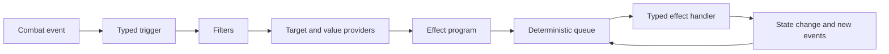

<div align="center">

# ⚙️ RogueDeck Core

### Build the mechanic. Keep the core clean.

A deterministic, modular C# combat engine for roguelike deckbuilders.
**Combat Engine v1 is complete and ready to embed** — strange mechanics compose *into* it instead of turning
the core into a giant switch statement.

<br>

<a href="https://github.com/Paranoidgrinch/RogueDeck-Core">
  
</a>
<a href="https://github.com/Paranoidgrinch/RogueDeck-Core/tree/main/src/RogueDeck.Core/Combat">
  
</a>
<a href="https://moonvineforge.com/card-forge.html">
  
</a>

<br><br>

[](https://github.com/Paranoidgrinch/RogueDeck-Core/actions/workflows/ci.yml)


</div>

---

## Why it exists

Most combat code rots the same way: every new card, relic or status teaches the *whole* engine what it is,
until the core is one enormous switch statement nobody dares to touch.

RogueDeck Core takes the opposite bet. Mechanics are **composed** from a small set of primitives on a
deterministic queue, so the hundredth mechanic is no harder to add than the first — and the same final state
is reproducible from the same seed, every time.

It is a finished, tested **engine you can use today**: drive it from your own game, script fights in code, or
design them live in the browser sandbox. It is not a game itself — it carries no rendering, input or themes,
only the reusable combat language beneath a deckbuilder.

---

## The rule above all others

> **Adding a new effect must not require changing the central resolver.**

Everything is built around composition rather than special cases:

* no central switch over concrete effects
* no hardcoded `PoisonStacks`, `IsStunned` or `Thorns` fields
* no game-specific rules hidden inside turn processing
* no effects bypassing the deterministic queue
* no unrelated systems changing whenever a new mechanic appears

A mechanic joins the engine through focused definitions, handlers, providers and packages — not by teaching
the entire core what that mechanic is.

---

## Compose mechanics instead of hardcoding them

Triggered mechanics are separated into five questions:

```text
WHEN       What happened?
IF         Which conditions must match?
WHO        Which combatants are affected?
HOW MUCH   How is the value calculated?
WHAT       Which primitive effect is requested?
```

An existing event combines with an existing effect without another event-specific engine class:

```text
WHEN damage is received          WHEN a skill card is played
IF   the target has Thorns       IF   it is the second skill this turn
WHO  the attacker                WHO  the player
HOW  the current Thorns value    HOW  1
WHAT deal damage                 WHAT draw cards
```

The content describes the interaction. The engine resolves it.

---

## How resolution works



Effects and events continue through the queue until the chain is complete or combat ends. Chain ancestry,
re-entry rules and configurable depth limits keep reactive mechanics powerful without allowing accidental
infinite loops — and a snapshot can be hashed at any point, so identical inputs prove identical outcomes.

---

## Getting started

### Prerequisites

* [.NET 10 SDK](https://dotnet.microsoft.com/download/dotnet/10.0)
* Git

### Get the code and verify it

```bash
git clone https://github.com/Paranoidgrinch/RogueDeck-Core.git
cd RogueDeck-Core
dotnet restore
dotnet test          # ~1,300 tests across the solution
```

CI runs the same suite on Windows + Linux, verifies formatting with `dotnet format`, and builds the
benchmarks on every push and pull request to `main`.

### Try it live in the browser

```bash
dotnet run --project src/RogueDeck.Sandbox
```

Open the printed `http://localhost:<port>` URL to define a hero, enemies and cards, then play the fight and
read the live log. The sandbox exposes the **whole** engine surface — every operation, value read, control
node, trigger, selector and interceptor — so you can author almost any mechanic without writing C#.

### Author a fight in code

The scenario harness is the ergonomic way to *use* the engine: describe a fight, script the turns, run them
on the real combat loop, and read what happened.

```csharp
using RogueDeck.Core.Combat;
using RogueDeck.Scenario.Authoring;
using RogueDeck.Scenario.Dsl;
using RogueDeck.Scenario.Reporting;
using RogueDeck.Scenario.Scripting;

var fight = new ScenarioBlueprint();

// A card: deal 8 damage to the chosen target, for 1 energy.
fight.Cards.Add(new CardBlueprint("strike")
{
    Program = Effects.Program(Effects.DealDamage(Targets.EventTarget, 8)),
}.Cost(StandardCombatIds.EnergyResource, 1));

// An enemy action: smash the hero for 12.
fight.EnemyActions.Add(new EnemyActionBlueprint("smash", new ActionIntent("Smash", IntentKind.Attack))
{
    Program = new EffectProgram<EnemyActionContext>(
        new DealDamageNode<EnemyActionContext>(
            CombatantTargetSelectors.EventTarget, new ConstantExpression<EnemyActionContext>(12))),
});

// The hero (with a small deck) and the enemy.
fight.Hero = new HeroBlueprint("knight")
{
    MaxHealth = 50,
    Deck = { new DeckEntry(new CardDefinitionId("strike"), Count: 3) },
};
fight.Hero.Resources.Add(new ResourceSpec(StandardCombatIds.EnergyResource, Current: 3, Max: 3));

var ogre = new EnemyBlueprint("ogre") { MaxHealth = 40 };
ogre.Actions.Add(new EnemyActionDefinitionId("smash"));
fight.Enemies.Add(ogre);

// Script the turns…
var script = new ScenarioScript()
    .HeroPlays("strike", "ogre")
    .HeroEndsTurn()
    .EnemyActs("ogre", "smash", "knight")
    .Build();

// …run them on the real engine, and read the narrative log.
var report = new ScenarioRunner().Run(new Playthrough(fight, script, combatId: "demo"));
Console.WriteLine(new NarrativeLogRenderer().Render(report));
```

Need lower-level control for your own game loop? Drop down to `RogueDeck.Core` directly — build a
`CombatDefinitionRegistryBuilder`, register a `StandardCombatPackage`, and drive a `CombatState` with the
`CombatReplayRunner` (`PlayCardCommand` / `EndTurnCommand`). `src/RogueDeck.ConsoleSandbox/Program.cs` is a
complete, runnable end-to-end example of exactly that.

### Embed it in your project

The engine is a plain .NET 10 library with no game dependencies. Reference `src/RogueDeck.Core` from your
solution, or `dotnet pack src/RogueDeck.Core` to produce a NuGet package you can consume locally. Everything
you author is pure C#, deterministic, and unit-testable without a UI.

---

## What you get

The combat core ships with:

* deterministic combat state and seeded randomness (snapshot → stable hash → replay)
* modular effect-request / handler registries and ordered effect + event queues
* turn, round and combat-result lifecycles
* cards, card instances and zones — draw, discard, exhaust, banish, retain
* card costs and cost modifiers; reusable resources and resource lifecycles
* status definitions with stacking, duration and charges
* damage, healing, block and defensive pools
* typed target selectors and value expressions
* card, status, resource and lifecycle triggers, with re-entry protection
* a modifier / interceptor pipeline (damage, block, cost, status application, death prevention)
* package-based registration, combat logging, and architecture-guard tests

Mechanics are authored as **Effect Programs** — typed trees of nodes (sequence, conditional, causal, repeat,
for-each) over native operations, value expressions and selectors — validated by a build-time preflight and
executed on the deterministic queue. Cards, enemy actions, triggered programs and runtime temporary rules all
run through the same runtime.

### The toolchain around the core

| Project | What it gives you |
| --- | --- |
| **`RogueDeck.Scenario`** | A fluent DSL to author a fight as blueprints + scripted turns, run it through the *real* engine, and render a readable play-by-play. |
| **`RogueDeck.Sandbox`** | A Blazor browser editor with complete practical engine coverage — author and play any mechanic, with JSON save/load and a live log. |
| **`RogueDeck.Sandbox/Fuzzing`** | A bot that generates random scenarios and plays them to surface crashes and determinism violations; a 20,000-seed sweep is clean. |

---

## Repository structure

```text
RogueDeck-Core
├── src
│   ├── RogueDeck.Core            # the engine library (Combat: Cards, Effects, Resources, …)
│   ├── RogueDeck.Scenario        # scripting harness: blueprints, fluent DSL, runner, narrative log
│   ├── RogueDeck.Sandbox         # Blazor browser editor + random-scenario fuzzer (Fuzzing/)
│   └── RogueDeck.ConsoleSandbox  # runnable end-to-end smoke demo
├── tests
│   ├── RogueDeck.Core.Tests      # the main engine suite (the executable specification)
│   ├── RogueDeck.Scenario.Tests
│   ├── RogueDeck.Sandbox.Tests   # includes the fuzzer regression test
│   └── RogueDeck.Core.Benchmarks # BenchmarkDotNet
└── .github/workflows/ci.yml
```

This README is the front door; the engine documents itself through code and tests. Start in
**`src/RogueDeck.Core/Combat`** for the engine and **`tests/RogueDeck.Core.Tests`** for a focused test of
every behaviour it guarantees (including the architecture-guard tests that enforce the rules above).

---

## Status

**Combat Engine v1: complete (strict) and green.** The full closure series shipped end to end — typed and
cardinality preflight, the complete generic trigger-parity matrix, temporary rules and delayed programs,
deterministic trace identities, snapshots + hashing + replay, and the modifier / interceptor pipeline.
~1,300 tests pass across the solution, formatting is clean, and a 20,000-seed fuzz sweep is clean.

Two behaviours are documented, stable v1 decisions rather than gaps: `CombatResultChanged` is
observable-but-non-triggerable (the queue stops at a terminal result), and only the `Combatant` target domain
exists (the machinery is enforced; other domains are a later phase). The Card Composition Engine (snippet
system / card generation) is intentionally **deferred** as a separate future project.

---

## Where it came from

RogueDeck Core grew out of the first playable systems beta of:

### 🧙 [Bureaucrats and Broomsticks](https://github.com/Paranoidgrinch/bureaucrats-and-broomsticks-v2)

A satirical fantasy roguelike deckbuilder about magic, paperwork and deeply questionable career choices.
Building a complete game revealed the cost of tightly coupled effects and event-specific action classes.

RogueDeck Core is the answer:

> Build the next mechanic without making the previous hundred harder to understand.

<a href="https://github.com/Paranoidgrinch/bureaucrats-and-broomsticks-v2/releases/latest">
  
</a>

---

## Try to break the architecture

Have a mechanic that *should* be hard to represent? Bring it. A card, relic, status, resource, curse, enemy
action, triggered interaction or completely unreasonable combat rule — the most useful ideas are not the
balanced ones, they are the ones that force the engine to prove its modularity.

For a mechanic proposal, describe: **what causes it, which conditions apply, who it targets, how its value is
calculated, and what effect it produces.**

<div align="center">

<a href="https://github.com/Paranoidgrinch/RogueDeck-Core/issues/new">
  
</a>
<a href="https://moonvineforge.com/card-forge.html">
  
</a>

</div>

---

<div align="center">

### New effects should extend the language — not expand the switch statement.

<br>

<a href="https://github.com/Paranoidgrinch/RogueDeck-Core">
  
</a>
<a href="https://github.com/Paranoidgrinch">
  
</a>

<br><br>

<a href="https://moonvineforge.com"><strong>Moonvine Forge Studios</strong></a>

<br>

<em>Small studio. Careful craft. Unusual worlds.</em>

</div>
